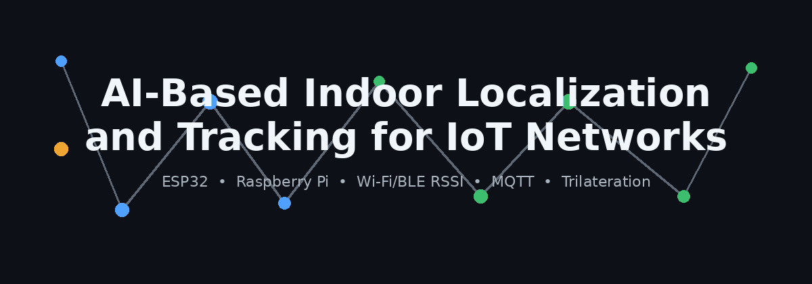
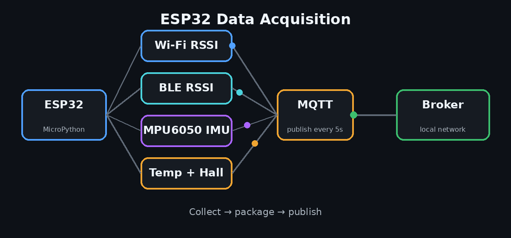
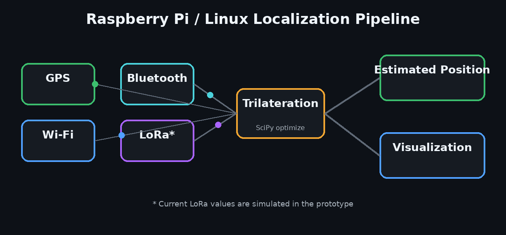
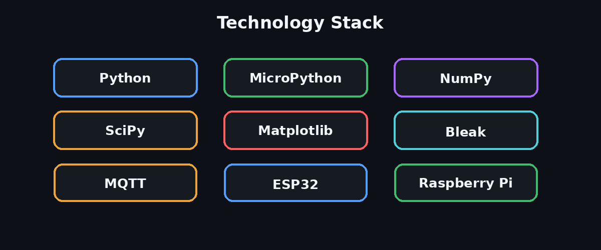

<p align="center">
  
</p>

<p align="center">
  <b>Hybrid IoT localization prototype using ESP32, Raspberry Pi, Wi-Fi/BLE RSSI, GPS, MQTT, and trilateration.</b>
</p>

---

## System Overview

<p align="center">
  
</p>

<p align="center">
  ESP32 collects Wi-Fi RSSI, BLE RSSI, MPU6050 IMU data, temperature, and hall-sensor readings, then publishes the payload through MQTT.
</p>

---

## Localization Pipeline

<p align="center">
  
</p>

<p align="center">
  The Raspberry Pi / Linux application combines GPS, Wi-Fi, Bluetooth, and simulated LoRa measurements, then estimates position using trilateration and SciPy optimization.
</p>

---

## Technology Stack

<p align="center">
  
</p>

---

## Repository Structure

```text
ai-indoor-localization-iot/
├── src/
│   └── raspberry_pi_localization.py
├── firmware/
│   └── esp32/
│       ├── main.py
│       └── config.example.py
├── docs/
├── assets/
│   └── readme/
├── requirements.txt
├── .gitignore
└── README.md
```

---

## Quick Start

```bash
git clone https://github.com/Elgazar1414/ai-indoor-localization-iot.git
cd ai-indoor-localization-iot
pip install -r requirements.txt
python src/raspberry_pi_localization.py
```

> **Prototype note:** the current Raspberry Pi script uses simulated LoRa values and experimental signal-source positions for localization testing and visualization.

---

## Academic Project

**AI-Based Indoor Localization and Tracking for IoT Networks**  
**Mostafa Elgazar** — Electrical and Communication Engineering  
The British University in Egypt
